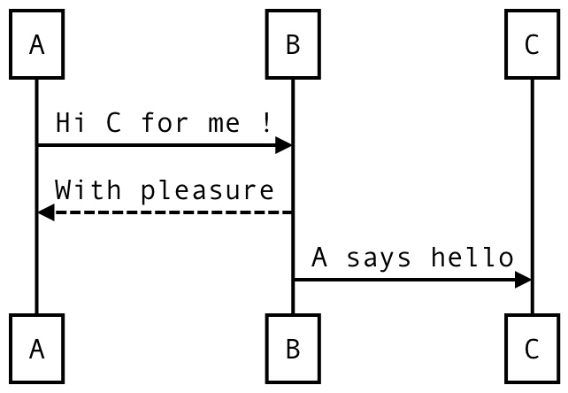
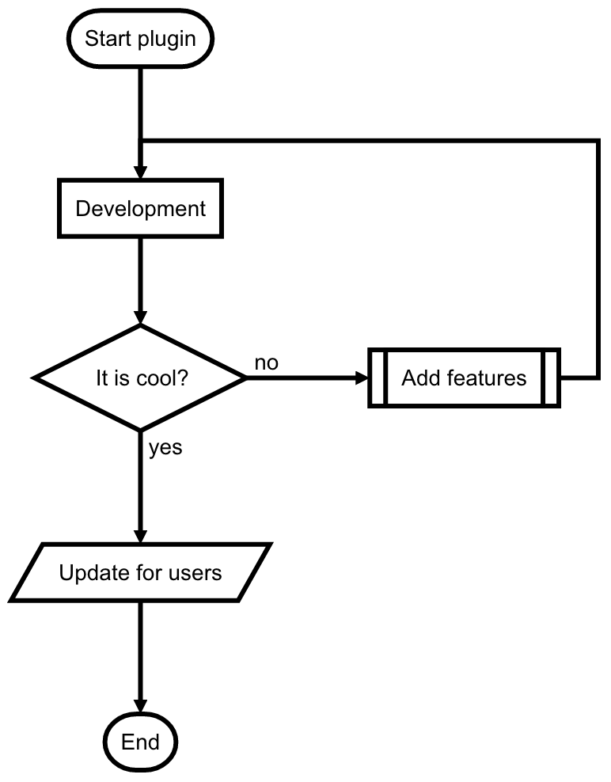
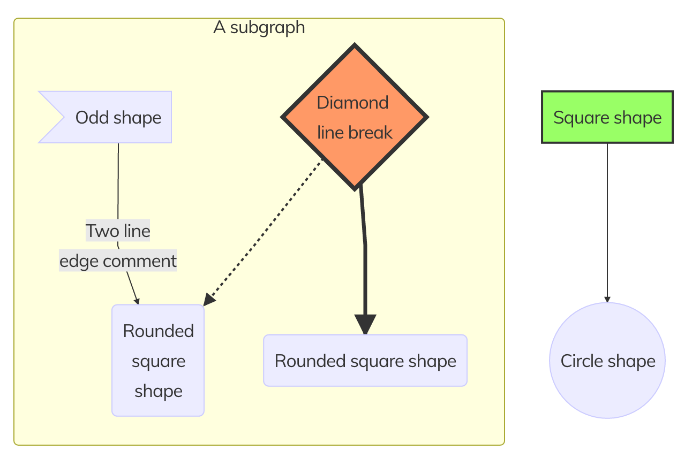
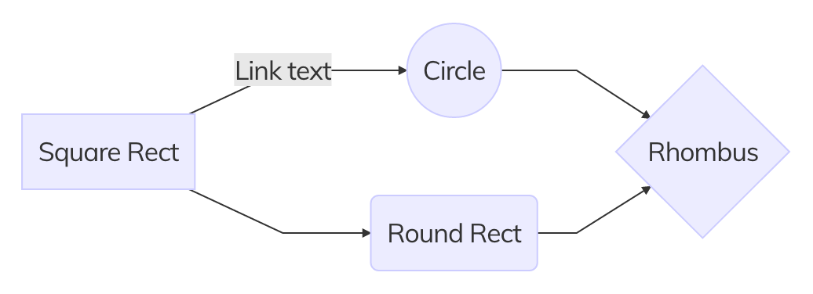

# Grav Diagrams Plugin

`diagrams` is a [Grav](http://github.com/getgrav/grav) plugin that adds simple and powerful diagrams functionality utilizing the Javascript plugin [js-sequence-diagrams](https://bramp.github.io/js-sequence-diagrams) and [flowchart-js](https://github.com/adrai/flowchart.js).

⚠️ Not having enough time to devote to this plugin, its development is no longer actively maintained. There will be no additional features developed, however pull requests are accepted and will be treated with pleasure 👍

# Installation

Installing the Diagrams plugin can be done in one of two ways. GPM (Grav Package Manager) installation method enables you to quickly and easily install the plugin with a simple terminal command, while the manual method enables you to do so via a zip file.

## GPM Installation (Preferred)

The simplest way to install this plugin is via the [Grav Package Manager (GPM)](http://learn.getgrav.org/advanced/grav-gpm) through your system's Terminal (also called the command line).  From the root of your Grav install type:

    bin/gpm install diagrams

This will install the Diagrams plugin into your `/user/plugins` directory within Grav. Its files can be found under `/your/site/grav/user/plugins/diagrams`.

## Manual Installation

To install this plugin, just download the zip version of this repository and unzip it under `/your/site/grav/user/plugins`. Then, rename the folder to `diagrams`. You can find these files either on [GitHub](https://github.com/getgrav/grav-plugin-highlight).

You should now have all the plugin files under

    /your/site/grav/user/plugins/diagrams

> Note: This plugin is a modular component for Grav which requires [Grav](http://github.com/getgrav/grav) and a theme to be installed in order to operate.

# Usage

The plug-in is configured to be functional as soon as you finished installation.

## Sequence diagrams

To use it in an item of your site, you just have to write your sequence diagram as follows:

eg:

    [sequence]
	A->B:Hi C for me !
	B-->A:With pleasure
	B->C:A says hello
	[/sequence]

The plugin will transform this sequence to display the following diagram:

<p align="center">
  <br/>
  <i>Created diagram</i>
</p>

## Flow diagrams

You can also write your flow diagram as follows:

eg:

```
[flow]
st=>start: Start plugin
e=>end: End
op1=>operation: Development|success
sub1=>subroutine: Add features|success
cond=>condition: It is cool?|invalid
io=>inputoutput: Update for users|calm

st->op1->cond
cond(yes)->io->e
cond(no)->sub1(right)->op1
[/flow]
```

The plugin will transform this sequence to display the following diagram:

<p align="center">
  <br/>
  <i>Created diagram</i>
</p>

## Mermaid diagrams

The plugin supports now diagrams from [Mermaid](https://github.com/knsv/mermaid) generator. Demos are available on their [documentation](http://knsv.github.io/mermaid/#demos).
> Situation encountered during development : class diagram generated by Mermaid may be unreadable.

eg:

```
[mermaid]
graph TB
sq[Square shape] --> ci((Circle shape))

subgraph A subgraph
    od>Odd shape]-- Two line<br>edge comment --> ro
    di{Diamond <br/> line break} -.-> ro(Rounded<br>square<br>shape)
    di==>ro2(Rounded square shape)
end

classDef green fill:#9f6,stroke:#333,stroke-width:2px;
classDef orange fill:#f96,stroke:#333,stroke-width:4px;
class sq,e green
class di orange
[/mermaid]
```

The plugin will transform this sequence to display the following diagram:

<p align="center">
  <br/>
  <i>Created diagram</i>
</p>

eg:

```
[mermaid]
graph LR
    A[Square Rect] -- Link text --> B((Circle))
    A --> C(Round Rect)
    B --> D{Rhombus}
   C --> D
[/mermaid]
```

The plugin will transform this sequence to display the following diagram:

<p align="center">
  <br/>
  <i>Created diagram</i>
</p>

## Customization

Multiple colors are available for flow diagrams:
- **simple**: white, #FFFFFF
- **positive** : dark blue, #387EF5
- **success** : green, #9FF781
- **invalid** : red, #FA8258
- **calm** : blue, #11C1F3
- **royal** : purple, #CF86E9
- **energized** : yellow, #F3FD60

> Note: You can change colors at the end of the file : diagrams.php

# Settings

You can parameterize the plugin to suit your usage

```yaml
# General settings
# ****************

enabled: true	# Plugin activation
align: center	# Position of diagrams [left, center, right]

# Settings of sequence diagrams
# ****************

theme: simple # Diagrams' themes [simple, hand]

# Settings of flow diagrams
# ****************

font:
  size: 14		# General font size
  color: black	# General font color

line:
  color: black	# General color of lines

element:
  color: black	# General border color of elements

condition:
  yes: yes		# Default text for the arrows of positive condition
  no: no		# Default text for the arrows of negative condition

# Settings of mermaid
# ****************

gantt:
  axis: %d-%m-%Y # Default gantt diagram axis format (https://github.com/d3/d3-3.x-api-reference/blob/master/Time-Formatting.md)

```

# Updating

As development for the Diagrams plugin continues, new versions may become available that add additional features and functionality, improve compatibility with newer Grav releases, and generally provide a better user experience. Updating Diagrams is easy, and can be done through Grav's GPM system, as well as manually.

## GPM Update (Preferred)

The simplest way to update this plugin is via the [Grav Package Manager (GPM)](http://learn.getgrav.org/advanced/grav-gpm). You can do this with this by navigating to the root directory of your Grav install using your system's Terminal (also called command line) and typing the following:

    bin/gpm update diagrams

This command will check your Grav install to see if your Diagrams plugin is due for an update. If a newer release is found, you will be asked whether or not you wish to update. To continue, type `y` and hit enter. The plugin will automatically update and clear Grav's cache.

> Note: Any changes you have made to any of the files listed under this directory will also be removed and replaced by the new set. Any files located elsewhere (for example a YAML settings file placed in `user/config/plugins`) will remain intact.

## Manual Update

Manually updating Diagrams is pretty simple. Here is what you will need to do to get this done:

* Delete the `your/site/user/plugins/diagrams` directory.
* Downlaod the new version of the Diagrams plugin from either [GitHub](#).
* Unzip the zip file in `your/site/user/plugins` and rename the resulting folder to `diagrams`.
* Clear the Grav cache. The simplest way to do this is by going to the root Grav directory in terminal and typing `bin/grav clear-cache`.
